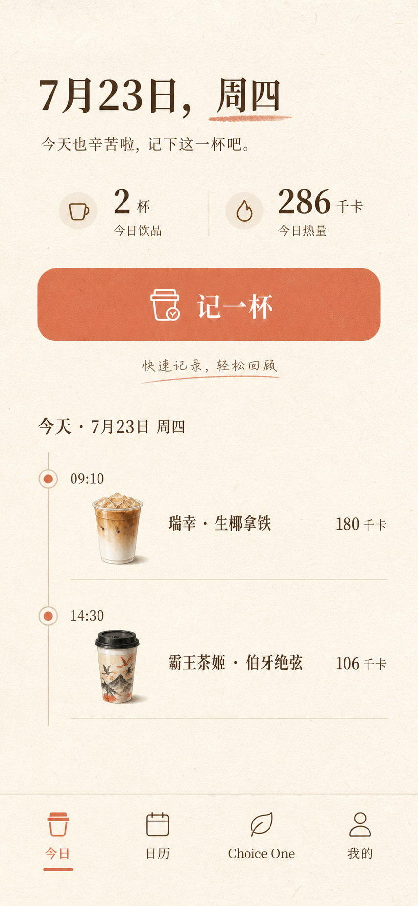
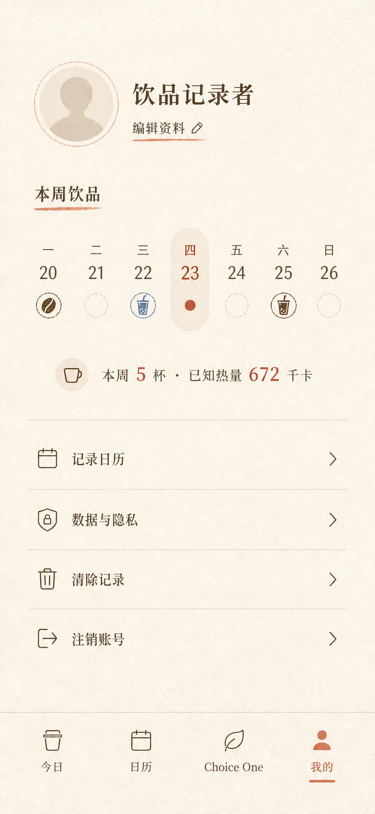

# WhatsDrink UI 设计走查

日期：2026-07-23

## 结论

整体视觉方向成立：纸张质感、宋体、咖啡棕与陶土橙形成了清晰的产品气质，首页主任务也足够突出。当前更大的问题不是“风格不好看”，而是交互规范和组件规则还没有完全收口，尤其集中在危险操作、核心表单、弱文字对比度、辅助功能语义和状态反馈。

本次为部分走查。已验收的视觉证据是仓库内的 Home / Profile 视觉基准，并检查了当前全部页面的 WXML、WXSS 与关键交互代码。真实小程序运行截图未能获取：微信开发者工具的 CLI 服务端口当前关闭，无法在不修改本机安全设置的情况下进行自动化截图。因此，字体回退、真实换行、安全区、Canvas 尺寸和运行时状态仍需真机或模拟器复核。

## 走查步骤

### 1. 今日页 — 需优化

健康度：视觉层级清楚，主按钮明确；记录列表的删除方式、次级文字与窄屏适应存在高优先级风险。

### 2. 我的页 — 需优化

健康度：个人信息、本周摘要、设置列表的分区易懂；普通入口与危险操作使用同一种样式，操作预期不够准确。

### 3. 日历、Choice One、记录表单及隐私弹层 — 部分检查

健康度：结构与功能完整，但真实渲染未捕获。以下问题来自当前界面结构、样式和交互代码，视觉结果需补拍确认。

## 做得好的地方

- 首页的日期、今日摘要、主 CTA、记录列表形成了自然的从上到下任务路径。
- 主要内容色 `#4A2E1F` 在纸色背景上对比充足；主按钮、设置行和底部导航的主体触控高度也较充裕。
- 颜色、插图和字体方向一致，没有混入无关的品牌视觉。
- 清除记录和注销账号都已有确认弹窗，注销还有二次确认，防误触逻辑是完整的。
- 自定义底部导航已提供 `role="button"` 和 `aria-label`，是当前辅助功能实现中较好的基础。

## 优先级问题

### P1 — 先修

1. **危险操作与普通导航长得一样。** “记录日历 / 数据与隐私 / 清除记录 / 注销账号”都使用同一行样式和右箭头；右箭头暗示“进入下一页”，但后两项实际会直接触发破坏性流程。建议将危险操作独立分组，去掉右箭头，使用危险色文字，并保持确认弹窗。

2. **首页用长按删除记录，不可发现且不利于无障碍操作。** 同一行轻触是编辑、长按是删除，界面上没有提示，也没有等价的键盘或读屏入口。建议改为左滑操作，或在编辑页提供明确的“删除记录”，首页只保留进入详情。

3. **记录表单在手机上过密，错误只用 Toast 呈现。** 两列表单让“分类、品牌、日期、时间、杯型、温度、甜度、评分、热量、价格”形成高密度之字形扫描；提交失败后，用户还要自己寻找出错字段。建议按“饮品 / 饮用信息 / 其他”分组，核心字段单列，日期时间可以并列；补充必填标记、字段级错误和自动定位。

4. **小字号弱文字与部分按钮存在对比度风险。** `#8B735F` 在 `#F8F1E5` 上约为 `3.97:1`，不满足普通小字号文本常用的 `4.5:1` 目标；选中态橙色 `#D96C4A` 在浅色背景上约 `3.02:1`，隐私授权按钮的小字号白字对橙底约 `3.26:1`。建议为小字号正文、说明文字和选中标签使用更深的 token；保留当前橙色用于大字号、粗体或非文字装饰。

### P2 — 接着修

5. **文字按钮没有统一的最小触控区域。** 全局 `.text-button` 为零内边距，候选项“移除”等按钮也很小。建议所有可点击文字至少提供约 `44 × 44px` 的舒适区域，最低不要低于 `24 × 24px`。

6. **组件规则存在漂移。** 相似的字段在记录页使用“仅底边线”，在转盘编辑页使用“完整描边”，昵称又回到底边线；相似辅助文字散落在 `20–29rpx` 的多个字号。建议建立少量明确 token：3–4 级字号、8pt 间距、输入框/选择器/文字按钮三类组件及固定状态。

7. **日历状态表达不完整。** 数据中已有 `isToday`，界面却没有渲染“今天”状态；有记录只用一个小圆点表示，未提供数量或辅助文本。建议同时区分“今天 / 选中 / 有记录”，并为日期按钮提供包含年月日、记录数、是否选中的完整标签。

8. **Choice One 的 Canvas 和动效缺少等价信息。** 转盘标签只画在 Canvas 上，结果变化没有显式的辅助技术通知；动画固定为 2.2 秒、旋转 6 圈并触发震动。建议提供候选文本列表或可读摘要、结果播报，并支持减少动效/跳过动画。

9. **列表在大字号或长品牌名下容易挤压。** 首页记录行同时放时间、图片、标题、元信息和热量，标题与元信息都强制单行省略。建议在窄屏和大字体下改成两行信息布局，把热量放到副信息区，避免关键信息被截断。

10. **加载状态没有进入视觉结构。** 首页虽然维护 `loading`，模板仍会先展示 0 和空状态；网络稍慢时可能出现“先空后有”的闪动。建议首次加载使用骨架或占位，刷新时保留旧内容并提供轻量进度状态。

11. **底部安全区实现需要真机复核。** 当前安全区元素向视口下方偏移，而导航本体没有把 `env(safe-area-inset-bottom)` 纳入内部高度；带 Home Indicator 的设备可能出现标签偏低或底部覆盖。建议把安全区作为导航内部 padding，并同步页面底部留白。

## 建议的修复顺序

1. 先处理危险操作、长按删除、表单错误恢复。
2. 收口颜色、字号、间距和触控区域 token。
3. 补齐日历、Canvas、表单和列表的辅助功能语义。
4. 在微信开发者工具中补拍 390 × 844 的今日页、我的页、日历、转盘、表单、隐私弹层，再做一轮字体、换行、安全区与组件状态复核。

## 证据限制

- 未验证真实设备上的宋体回退、Android 字形差异和动态字体缩放。
- 未验证读屏顺序、焦点移动、弹层焦点约束和状态播报。
- 未验证 Canvas 在不同设备像素比下的锐度与尺寸。
- 未验证加载、保存失败、无网络、权限拒绝和隐私授权的实际视觉状态。

最终状态：部分完成；视觉基准与代码级问题已走查，真实运行界面截图待微信开发者工具 CLI 服务开启后补齐。

## 2026-07-23 优化落实

已根据本报告完成第一轮实现：

- 将“清除记录 / 注销账号”移入独立危险操作分区，移除误导性的导航箭头。
- 移除首页长按删除；编辑记录页增加明确的危险操作入口。
- 记录表单按饮品信息、饮用信息、补充记录分组，补充必填提示与字段级错误。
- 加深弱文字、选中态和主操作色，统一常用字号、控件高度与圆角 token。
- 补齐文字按钮触控区域、日历今天/选中/记录数状态和底部安全区。
- 为记录列表、日期、表单、转盘结果和隐私弹层补充辅助功能标签与状态。
- Choice One 增加候选摘要和精简动效开关，并修正浅色扇区的文字颜色。
- 首页增加首次加载状态，记录列表改为更适合窄屏和长文本的两行信息布局。

代码结构检查、TypeScript 类型检查、WXML 结构检查及 14 项自动化测试均已通过。由于开发者工具 CLI 服务仍未开启，真实渲染复核仍待补拍。
