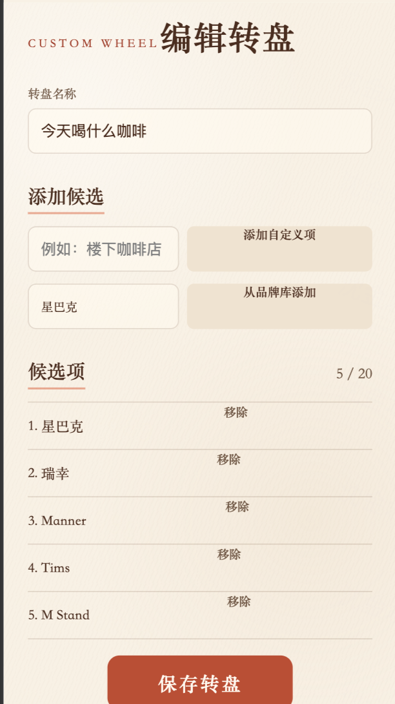

# 编辑转盘页面走查

## 证据

## 步骤

1. 进入“编辑转盘”页面：可用，但标题、表单和候选列表的层级不稳定。
2. 添加自定义候选或品牌候选：功能入口完整，但双列原生控件尺寸失衡。
3. 管理现有候选：信息可读，但“移除”操作没有稳定靠右。
4. 保存、复制或删除转盘：功能完整，但保存按钮与次要操作的层级需要统一。

## 主要发现

1. 英文眉题与中文标题都是行内文本，导致标题横向拥挤。
2. 两组添加入口缺少字段标签，按钮文案过长，并因原生按钮固有宽度占据半行。
3. 候选项只使用 `space-between`，原生“移除”按钮在不同渲染器中不能稳定靠右。
4. 保存按钮宽度没有在页面级明确约束，视觉重量与其他表单页面不一致。
5. 截图无法证明键盘焦点、读屏顺序、错误态和二次确认弹窗表现。

## 已实施

- 标题改为上下层级，并补充页面说明。
- 添加区改为“自定义候选 / 品牌库”两组标准表单行。
- 添加操作使用固定宽度本地图标按钮。
- 候选列表使用序号、名称、移除操作三列布局。
- 移除操作使用危险色与删除图标，并保留辅助功能标签。
- 保存按钮明确为全宽主操作；复制和删除保留为次要操作。
