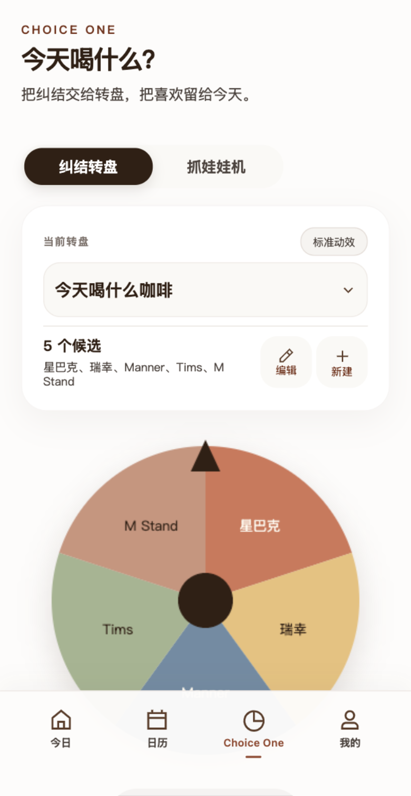
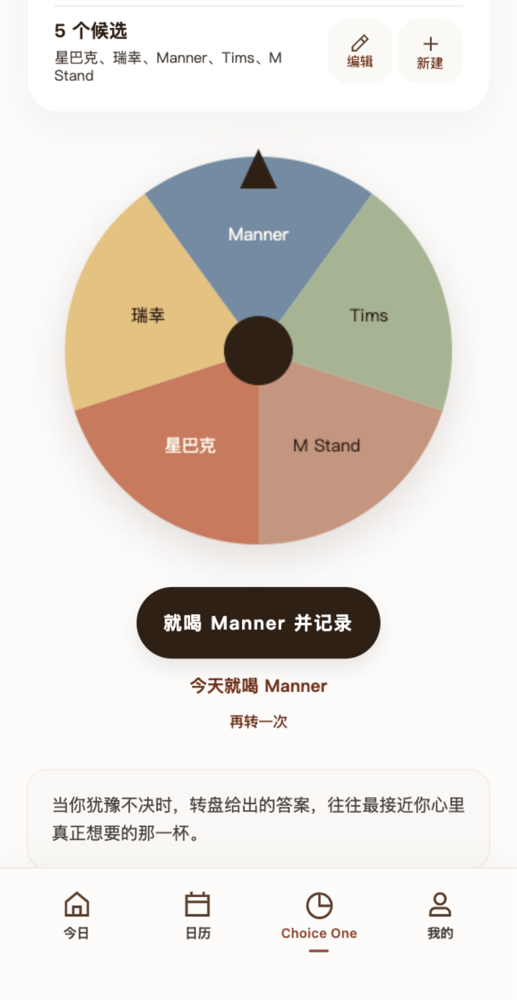
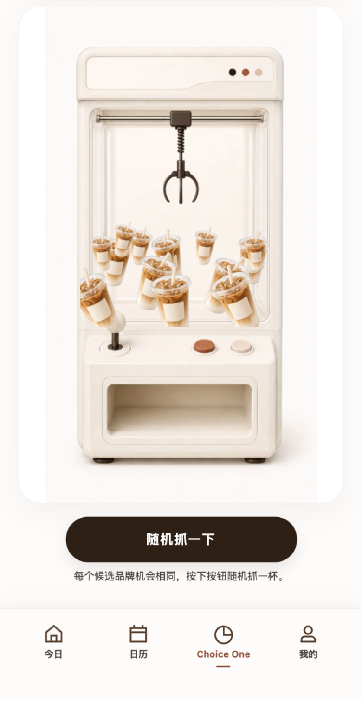
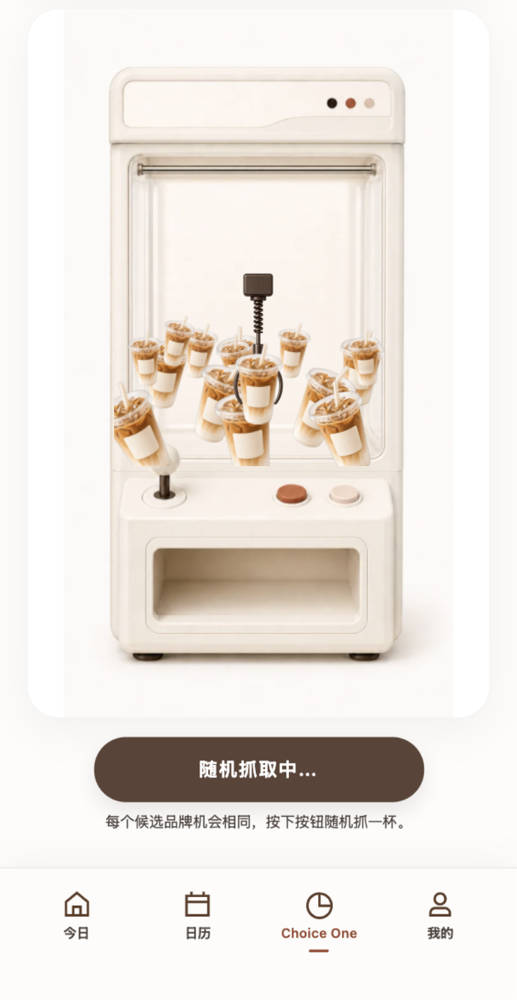
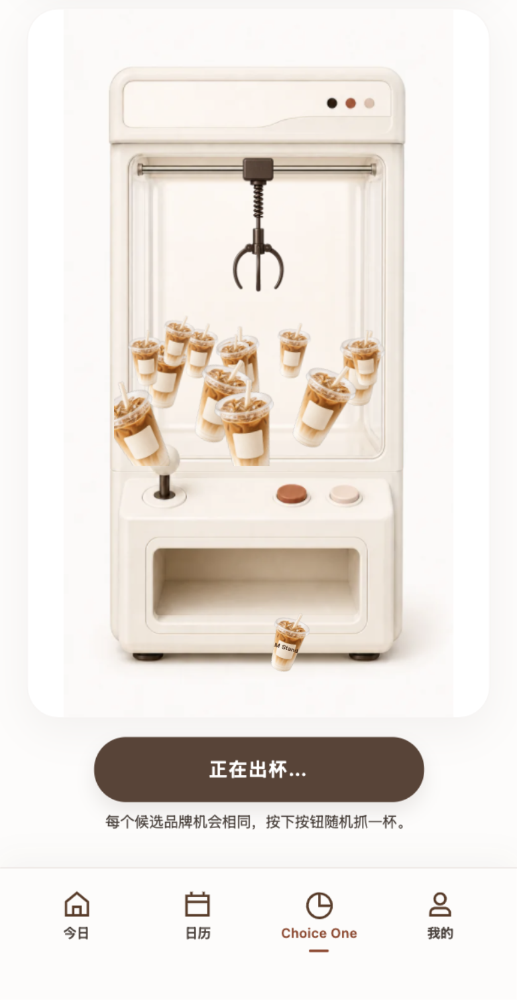
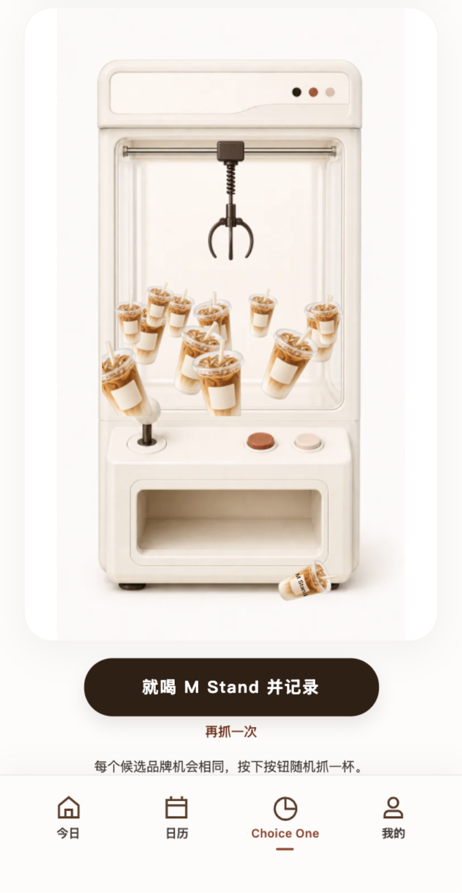
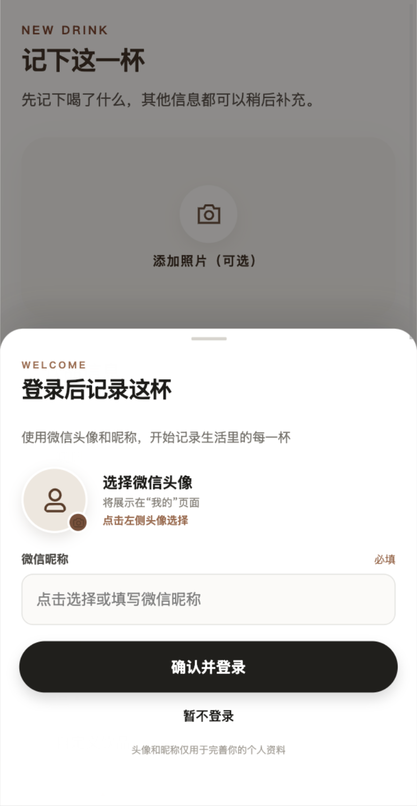

# Choice One 全量优化复验

日期：2026-07-26

## 已完成

- 转盘和抓娃娃机共用可操作的“标准动效 / 精简动效”控制。
- 五个候选品牌完整换行显示，不再截断最后一项。
- 结果直接接管当前主按钮，不新增首屏之外的结果卡片。
- 转盘结果按钮显示“就喝品牌并记录”，同时保留“再转一次”。
- 抓娃娃机按钮移到机器外，完整露出投放通道和取杯口。
- 机械爪抓住与抬升阶段保持无品牌，咖啡从出口滚出时才揭晓品牌。
- 抓取结果按钮显示“就喝品牌并记录”，同时保留“再抓一次”。
- 登录承接标题改为“登录后记录这杯”。
- 14 个视觉咖啡杯作为装饰内容隐藏，只播报抓取阶段和最终结果一次。

## 视觉复验

### 候选品牌完整显示

### 转盘结果原位确认

### 抓娃娃机出口无遮挡

### 抓取时保持无品牌

### 咖啡从出口滚出

### 抓取结果原位确认

### 登录承接

## 自动化结果

- 模式切换：2 个模式均可用。
- 抓娃娃机动效控制：1 个，可直接操作。
- 视觉奖池：14 杯。
- 抓取阶段品牌标签：0。
- 首屏外结果卡片：0。
- 转盘前后滚动位置：304 → 304。
- 抓取前后滚动位置：401 → 401。
- 记录承接：`pages/record-form/index`。
- 运行时异常：0。
- 项目校验：8 个测试文件、35 个测试全部通过。
