# Choice One 设计走查与测试

审计日期：2026-07-26

范围：纠结转盘、抓娃娃机、随机抓取全过程、结果确认、记录承接。

## 结论

核心体验已可用，且用户此前指出的主要实现问题均已通过：

- 转盘 / 抓娃娃机切换可见且可用。
- 抓娃娃机内有 14 个无品牌咖啡杯，均被限制在玻璃池区域。
- 五个候选品牌使用等宽随机区间，每个候选概率均为 20%。
- 抓取包含下落、抓住、抬升、松开、出杯和结果六段反馈。
- 抓取全过程页面滚动位置保持 340，没有发生屏幕跳动。
- 结果可进入记录表单；未登录用户会先看到登录承接。
- 7 个测试文件、29 个测试全部通过，类型检查和项目校验通过。
- 6 个媒体资源均低于 200 KB。

本轮未发现 P0 阻断问题；发现 1 个 P1、4 个 P2 和 1 个 P3。

## 用户路径

### 1. 进入 Choice One 并选择模式 — 健康

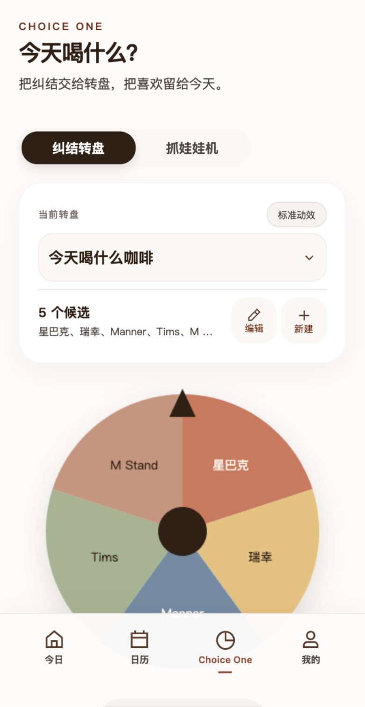

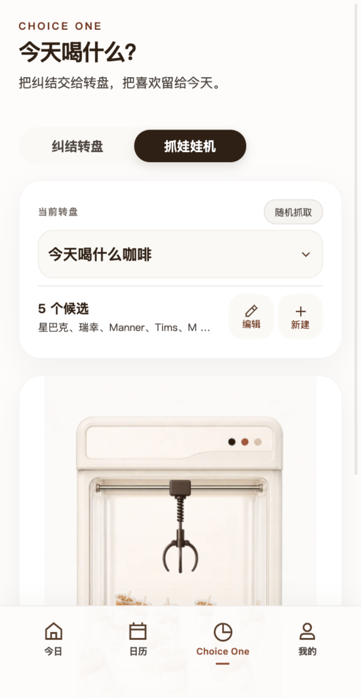

两种模式切换清楚，选中态强，触控区域充足。

### 2. 使用转盘并获得结果 — 基本健康

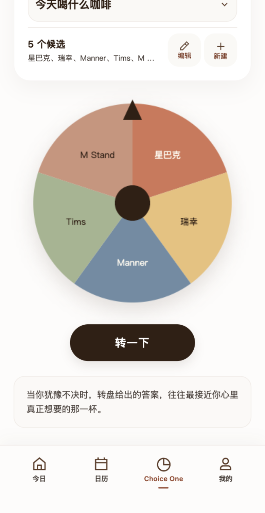

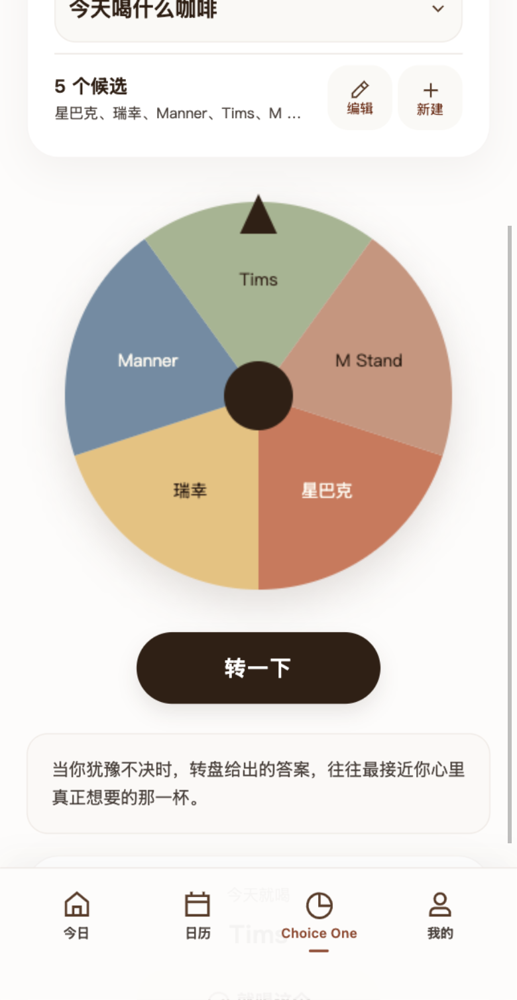

转盘本身的选择结果可识别，但结果确认操作在当前视口之外。

### 3. 查看抓娃娃机与奖池 — 健康

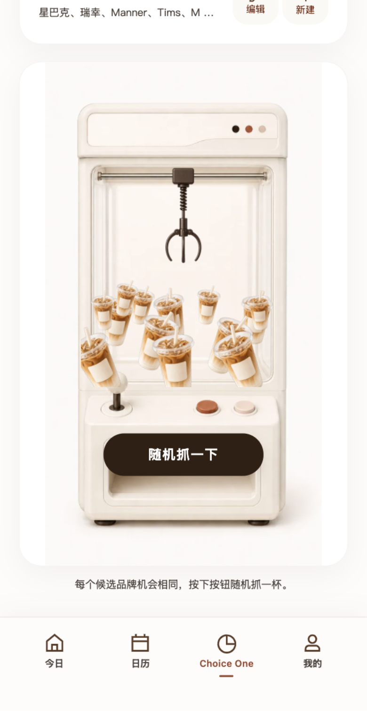

14 个无品牌咖啡杯保持在玻璃池内，密度与凌乱感接近真实机器。

### 4. 抓取过程 — 基本健康

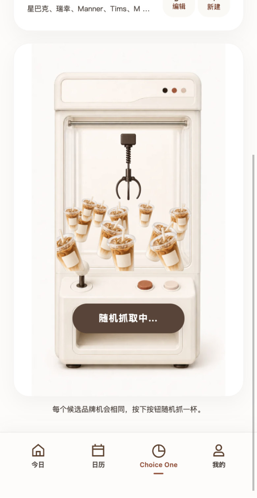

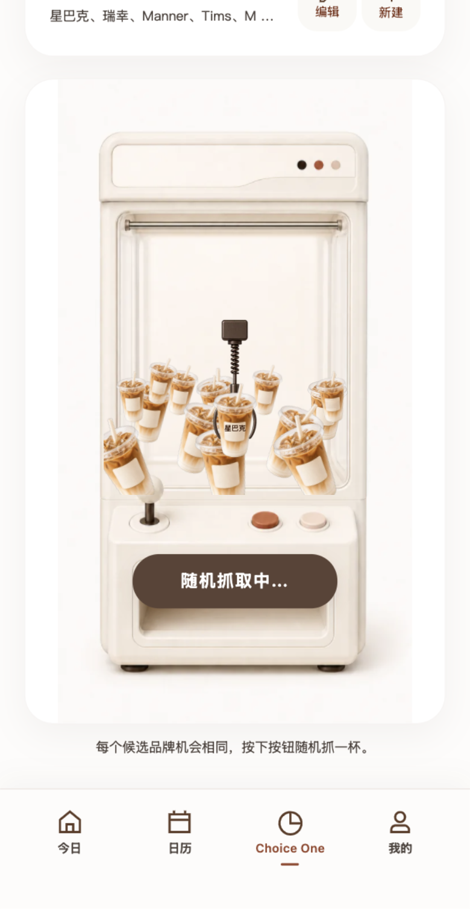

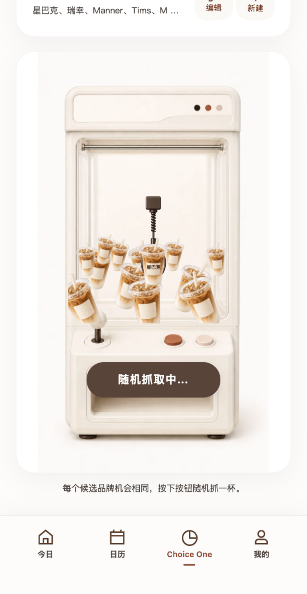

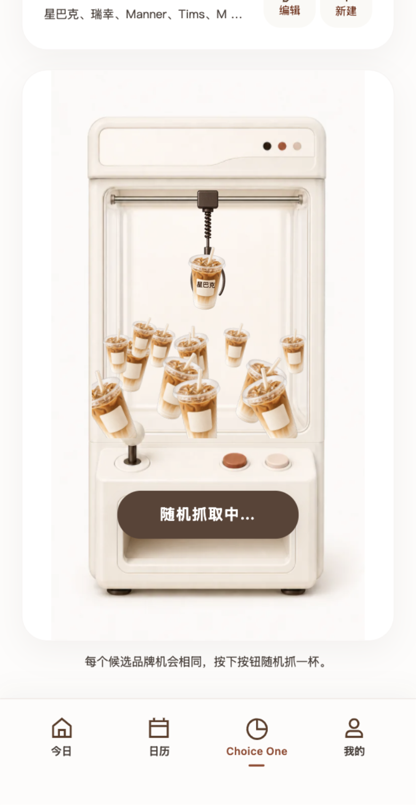

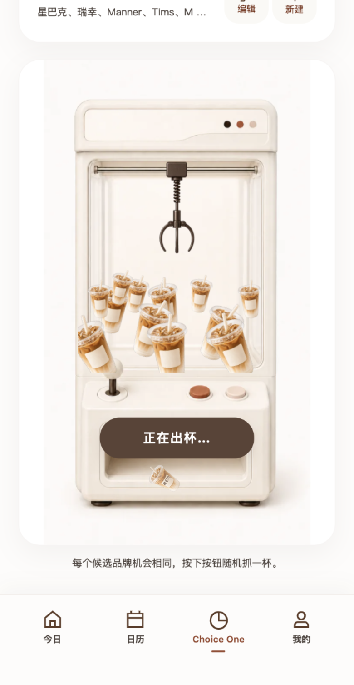

阶段完整、按钮状态清楚，且过程中页面位置保持不变。

### 5. 查看结果并继续记录 — 有摩擦

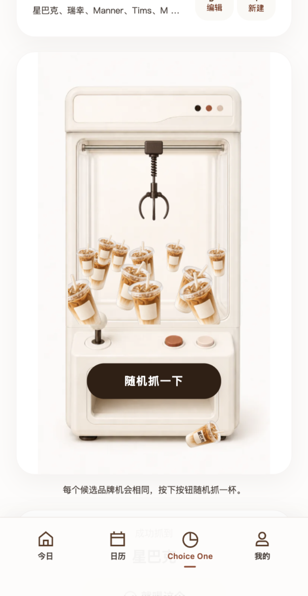

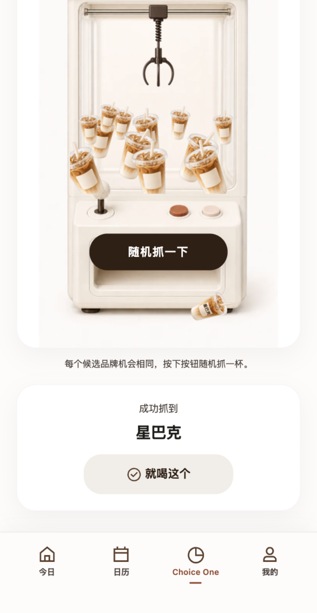

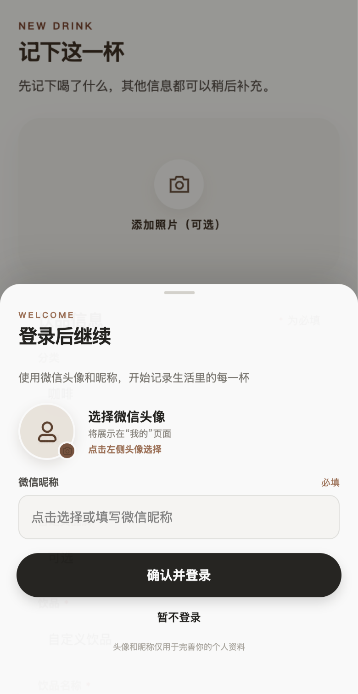

结果本身清楚，但需要手动滚动后才能看到“就喝这个”；未登录用户点击后会先进入登录层。

## 发现与建议

### P1 — 结果确认操作落到首屏之外

转盘和抓娃娃机完成后，结果面板都出现在固定底栏之后。用户看到“已经选中”，但看不到下一步操作，需要主动向下滚动。

建议不要自动滚屏，以免重新引入屏幕晃动。可以在结果出现时，将当前视口内的“转一下 / 随机抓一下”原位变成“就喝 Tims / 就喝星巴克”，或在固定底栏上方出现轻量结果条。

### P2 — 出杯路径被主按钮遮挡

咖啡从机械爪位置切换到出口时，主按钮覆盖了投放通道，视觉上更像咖啡突然出现在按钮下方，削弱了真实抓娃娃机的连续性。

建议把操作按钮移到机器卡片外，或放在不遮挡取物口的控制台区域；保留“掉入内部通道、短暂消失、从出口滚出”的完整路径。

### P2 — 抓娃娃机模式无法直接控制精简动效

精简动效状态会影响抓娃娃机，但该控制只在转盘模式出现；抓娃娃机位置显示的是不可操作的“随机抓取”标签。

建议把动效控制做成两个模式都能访问的全局开关，并保持同一位置和命名。

### P2 — 奖池对屏幕阅读器信息过载

14 个视觉杯分别标记为相同的列表项“无品牌咖啡杯”，屏幕阅读器可能连续朗读 14 次相同内容。

建议将单个杯子标记为装饰性内容，只为奖池提供一次整体说明，并用一个动态状态区域播报“正在抓取 / 成功抓到星巴克”。

### P2 — “就喝这个”之后出现登录，预期没有提前建立

未登录用户点击结果确认后，马上进入“登录后继续”层。登录本身是当前产品规则，但 CTA 没有说明下一步是记录与登录。

建议将按钮文案调整为“就喝这个并记录”，或把登录推迟到最终保存时，避免决策完成后的节奏被突然打断。

### P3 — 五个候选仍被截断

候选摘要在只有五项时仍显示为“星巴克、瑞幸、Manner、Tims、M …”，用户无法一次核对完整品牌池。

建议允许摘要显示两行，或在抓娃娃机模式使用紧凑品牌标签。

## 验证记录

| 检查项 | 结果 |
| --- | --- |
| 模式切换 | 2 个 tab 均可用 |
| 视觉奖池 | 14 杯、0 个池内品牌标签 |
| 随机概率 | 5 个等宽区间，各 20% |
| 抓取阶段 | lowering → gripping → lifting → releasing → rolling → won |
| 页面稳定性 | 抓取前后及所有阶段均为 scrollTop 340 |
| 转盘稳定性 | 转动前后均为 scrollTop 268 |
| 结果承接 | 进入 `pages/record-form/index` |
| 运行异常 | 0 |
| 自动化测试 | 7 个文件、29 个测试全部通过 |
| 项目检查 | 类型检查、结构检查、媒体大小检查通过 |

## 无障碍范围说明

本轮通过界面截图、模板语义和自动化交互检查了可见层级、触控路径、状态反馈及部分辅助技术标注，但没有使用真实手机、VoiceOver / TalkBack 或不同系统字体缩放做完整无障碍合规测试，因此不作 WCAG 或微信小程序无障碍合规结论。
